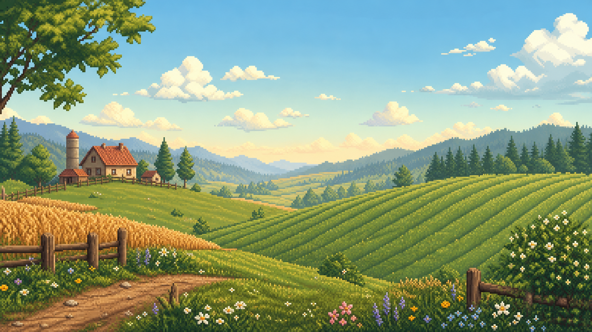

# Pelican Farm for Navidrome

An original cozy pixel-farm theme for [Navidrome](https://www.navidrome.org/), featuring parchment panels, dark wooden navigation, cream-colored sidebar text, green controls, golden player accents, and a pixel-art farm login background.

一套原创的 Navidrome 温暖农场像素主题，包含羊皮纸内容区、深木色导航栏、浅黄色侧栏文字、绿色操作按钮、金色播放器，以及像素农场登录背景。



> [!NOTE]
> This is an unofficial community theme. It does not contain characters, logos, maps, or artwork from Stardew Valley. The included background is an original AI-generated asset.

## Features / 特色

- Cozy 16-bit-inspired farm palette / 温暖的 16-bit 农场配色
- High-contrast cream sidebar labels and icons / 高对比度浅黄色侧栏文字与图标
- Pixel borders, hard shadows, and stepped interactions / 像素边框、硬阴影和步进交互
- Styled album cards, tables, forms, login screen, and audio player
- Desktop and mobile player styling / 桌面端和移动端播放器样式
- Chinese font fallback through `Noto Sans SC`, with no external font download

## Compatibility / 兼容性

The theme follows Navidrome's Material UI v4 theme structure and has been built and tested against **Navidrome 0.62.0**.

Navidrome themes are compiled into the web UI. Installing this theme therefore requires building Navidrome from source; copying the files into an already-installed binary is not sufficient.

主题基于 Navidrome 的 Material UI v4 结构，并已在 **Navidrome 0.62.0** 上完成构建验证。Navidrome 会将主题编译进 Web UI，因此必须重新编译源码，不能只把文件复制到现有安装目录。

## Installation / 安装

1. Check out the Navidrome source version matching your installation.

2. Copy the files into the corresponding theme directory:

   ```text
   ui/src/themes/stardewValley.js
   ui/src/themes/stardewValley.css.js
   ui/src/themes/assets/farm-sunrise.png
   ```

3. Register the theme in `ui/src/themes/index.js`. For Navidrome 0.62.0, the included patch can be applied from the Navidrome repository root:

   ```bash
   git apply /path/to/navidrome-pelican-farm-theme/index.patch
   ```

   If the patch does not match a newer Navidrome release, add these lines manually:

   ```js
   import StardewValleyTheme from "./stardewValley";
   ```

   ```js
   export default {
     // ...existing themes
     StardewValleyTheme,
   };
   ```

4. Follow the [official Navidrome build instructions](https://www.navidrome.org/docs/developers/creating-themes/) to build the UI and server.

5. Start Navidrome and select **Pelican Farm** in the theme selector. To make it the default for new browser sessions, add this to `navidrome.toml`:

   ```toml
   DefaultTheme = "Pelican Farm"
   ```

## Updating / 更新

Replace the three theme files with the latest versions, rebuild Navidrome, and restart the service. Keep a backup of the original Navidrome executable and configuration before replacing a production installation.

更新时替换三个主题文件，重新构建 Navidrome 并重启服务。替换生产环境程序前，请备份原始可执行文件和配置。

## Project structure / 项目结构

```text
.
├── index.patch
└── ui/src/themes
    ├── assets/farm-sunrise.png
    ├── stardewValley.css.js
    └── stardewValley.js
```

## License

Code and the included original background asset are released under the [MIT License](LICENSE).

This project is not affiliated with or endorsed by Navidrome or ConcernedApe.
